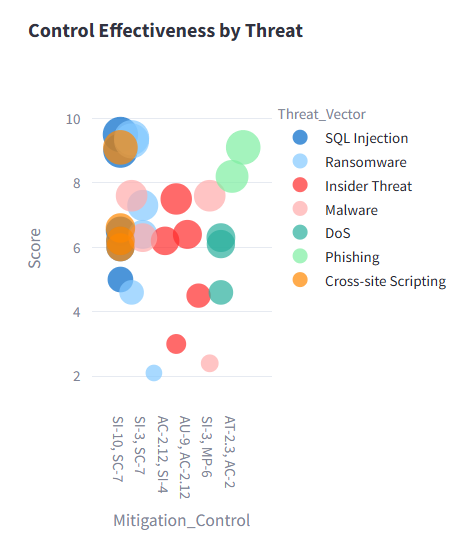

# 🔐 Threat & Risk Assessment (TRA) Tracker

A streamlined, interactive web application to manage Threat and Risk Assessments (TRA), which is built with **Streamlit**.
This end-to-end application to streamline threat vector analysis, risk assessment scoring, SLA monitoring, and mitigation tracking. Designed for security teams, analysts, and compliance officers, this tracker brings together CVSS-based scoring, SLA breach detection, and interactive dashboards, all integrated into a lightweight and easily deployable system.

---

## Key Features

### Submit New TRA

* Define asset, and owner.
* Select or define custom threat vectors.
* Evaluate **Likelihood** and **Impact** using CVSS-like scoring.
* Assign **NIST SP 800-53** mitigation controls.
* Auto-calculates risk score and stores entry in **SQLite** database.
* Track risk status (Open, Mitigated, Critical).

### TRA Dashboard Outcomes

Gain actionable intelligence via rich, interactive dashboards:

* **Threat Vector Analysis**

  * Pie chart of vector distribution

  

  * Box plot of risk score by vector

  


* **Mitigation Control Analysis**

  * Top control usage (horizontal bar chart)

  

  * Control vs. threat effectiveness (scatter plot)

  


* **Temporal Risk Trends**

  * Line chart showing monthly average score & TRA count

  


* **Summary Statistics**

  * Descriptive analytics (mean, std, min, max) for numerical features

### CISO Summary & SLA Monitoring

* Automatically detects TRAs breaching the 30-day SLA threshold.
* Lists **Overdue entries** and highlights **Critical (Score ≥ 8.5)** items.
* Generates a **CISO Summary PDF Report** with:

  * Top 5 critical risks
  * Mitigation descriptions
  * Time-stamped control mappings


---

## Tech Stack

| Component   | Description                       |
| ----------- | --------------------------------- |
| `Streamlit` | Web interface and form handling   |
| `SQLite`    | Lightweight embedded database     |
| `Plotly`    | Interactive visualizations        |
| `FPDF`      | PDF report generation             |
| `Pandas`    | Data transformation and filtering |

---

## Project Structure

```
.
├── app.py                      # Main Streamlit interface
├── setup.sh                    # Shell script to set up and launch app
├── requirements.txt            # Python dependencies
├── data/
│   ├── tra_data.db             # Auto-generated SQLite database
│   └── mitigation_controls.csv # Mitigation control catalog
├── utils/
│   ├── calculate_cvss.py       # Scoring logic
│   ├── threat_selection.py     # Custom threat input logic
│   ├── sla_tracker.py          # SLA overdue checker
│   ├── pdf_exports.py          # PDF report builder
│   └── visualization.py        # Plotly-based dashboard charts
└── images/
    ├── control_threat.png         # Mitigation Control Threat
    ├── mitigation_control.png     # Top Mitigation Control
    ├── risk_score_threat.png      # Risk score by threat
    ├── temporal_risk_trends.png   # Temporal Risk Trends
    └── threat_vector.png          # Threat Vector Distribution
```

---

## Setup Instructions

### Prerequisites

* Python 3.8+
* Git (for cloning, optional)

### Quick Start (Using setup.sh)

```bash
git clone https://github.com/bnvaidya20/threat-risk-assessment-tracker.git
cd threat-risk-assessment-tracker
chmod +x setup.sh
./setup.sh
```

This script will:

1. Create a virtual environment
2. Install required packages from `requirements.txt`
3. Create necessary folders like `/data`
4. Launch the Streamlit app at `http://localhost:8501`

### **Access the app at**:

   ```
   http://localhost:8501
   ```

---

## Risk Scoring Methodology

Scoring is based on:

```python
score = Likelihood_weight × Impact_weight × 10
```

where weights are:

* `Low = 0.3`, `Moderate = 0.6`, `High = 0.9`

Classification:

* `Critical ≥ 9`, `High ≥ 7`, `Medium ≥ 4`, `Low < 4`

---

## Sample Data

* Ensure `data/mitigation_controls.csv` exists with `Control_ID` and `Description` columns.
* TRA entries are stored in `data/tra_data.db` and automatically created if missing.

---

## Future Enhancements

* User authentication & role-based access
* External threat intelligence feed ingestion
* REST API integration for remote TRA submissions
* Exportable JSON/CSV reports

---

## 📜 License

MIT License © 2025 BipraTek Solutions

